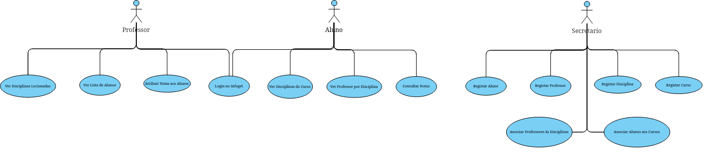

# Infoget a melhor plataforma escolar 📚✨


## Sobre o Projeto 📝

O **Infoget** é uma plataforma escolar desenvolvida como trabalho final para a disciplina de Engenharia de Software II, com o objetivo de facilitar a gestão e organização dos dados escolares de alunos e professores.

Com o Infoget, é possível registar alunos e professores, atribuir disciplinas a cursos, vincular professores a disciplinas, associar alunos a cursos, e muito mais. Além disso, a plataforma integra LLM localmente para oferecer conversas sobre técnicas de estudo, geração de exercícios, e suporte para tirar dúvidas sobre a matéria.

<details>
    <summary>História do projeto</summary>
    
</details>

## Equipa do Projeto 🫂
- [Afonso Carrasquinho](https://github.com/Afonso295)
- [António Vieru](https://github.com/antonuolink)
- [Diogo Vieira](https://github.com/xXD4rkSoulXx)
- [João Ribeiro](https://github.com/anotherlusitano)
- [João Aguiar](https://github.com/joaoaguiiar)

## Objetivo do Projeto 🎯

O principal objetivo do Infoget é proporcionar uma solução robusta e eficiente para a gestão de dados escolares, facilitando o acesso e a organização das informações tanto para alunos quanto para professores. Este projeto foi desenvolvido como trabalho final para a disciplina de Engenharia de Software II, com o intuito de aplicar os conhecimentos adquiridos ao longo do curso.

## Tecnologias Utilizadas 🛠️

- **Laravel** - Framework PHP para o backend
- **ReactJS** - Biblioteca JavaScript para o frontend
- **MariaDB** - Sistema de gestão de base de dados
- **PHP** - Linguagem de programação para o backend
- **Ollama** - Integração de LLM

## Funcionalidades Principais 🌟

- **Registo de Alunos e Professores** 📝
- **Login Seguro** 🔐
- **Gestão de Cursos e Disciplinas** 🎓
- **Atribuição de Professores a Disciplinas** 👨‍🏫
- **Associação de Alunos a Cursos** 👩‍🎓
- **Integração com LLM** 🤖

## Diagramas do Sistema 📊



## Diagrama de Classes 🧩


## Como Executar Localmente 🖥️

### Pré-requisitos
- PHP (8.0+), Composer, Laravel, Node.js, MariaDB/MySQL, Git.

### Passos
1. Clone o repositório:
   ```bash
   git clone https://github.com/anotherlusitano/ESTG-ES2-Infoget.git
   cd infoget
   ```

2. Instale as dependências:
   ```bash
   composer install
   npm install
   ```

3. Configure o ambiente:
   - Mude o nome do `.env.example` para `.env` e ajuste as credenciais da base de dados.
   - Gere a chave da aplicação:
     ```bash
     php artisan key:generate
     ```

4. Configure a base de dados:
   - Crie a base de dados `estg_es2_infoget`.
   - Execute as migrações:
     ```bash
     php artisan migrate
     ```

5. Compile os assets do frontend:
   ```bash
   npm run dev
   ```

6. Inicie o servidor:
   ```bash
   php artisan serve
   ```

7. Acesse:
   - Abra o navegador em [http://127.0.0.1:8000](http://127.0.0.1:8000).

### Configurar o Chat Bot (LLM) 🤖

Para utilizar o Chat Bot integrado ao Infoget, é necessário ter o **Ollama 3.2** instalado e em execução localmente. Siga os passos abaixo:

1. **Instale o Ollama:**
   - Instale o Ollama a partir do [site oficial](https://ollama.com/).

3. **Execute o Ollama:**
   - Inicie o Ollama e certifique-se de que ele está a ser executado na porta http://127.0.0.1:11434.

4. **Teste o Chat Bot:**
   - Acesse a funcionalidade de Chat Bot no Infoget e interaja com o LLM para tirar dúvidas, gerar exercícios ou obter dicas de estudo.

## Documentação 📄

Para mais detalhes sobre o projeto, consulte os seguintes documentos:

- [Documento de Visão](./docs/docvisao.md)
- [User Stories](./docs/UserStories.md)
